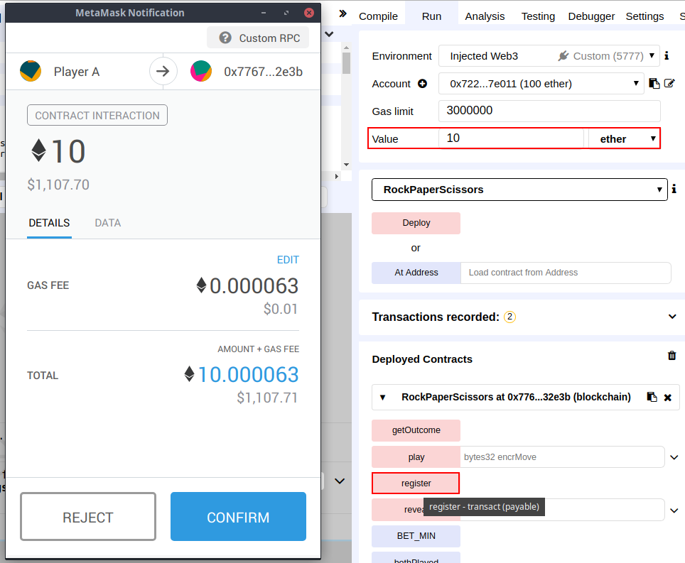
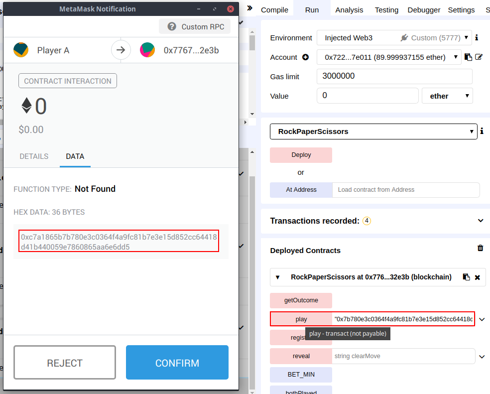
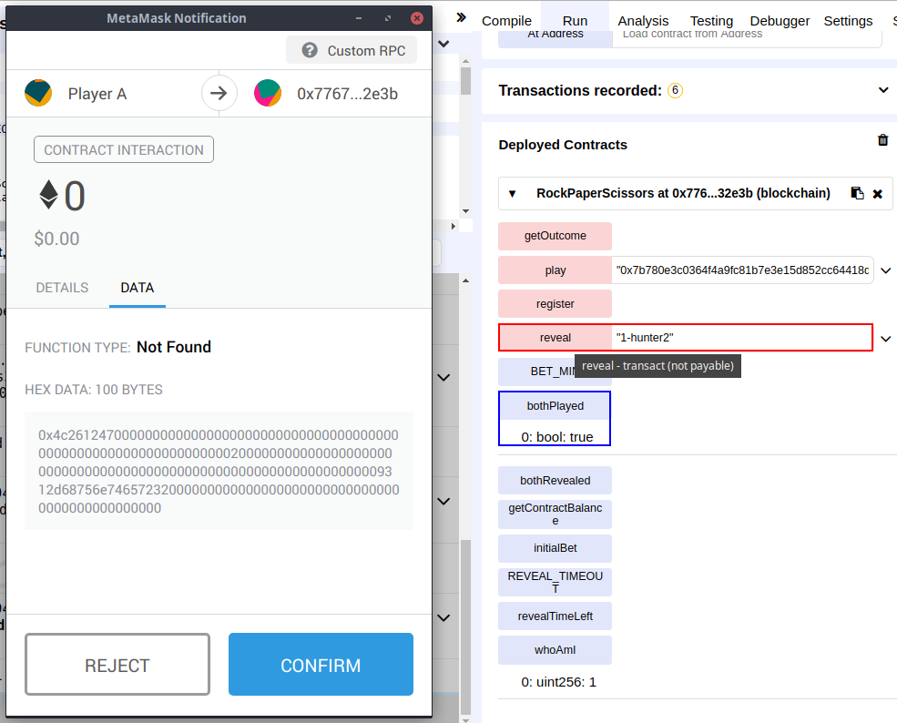
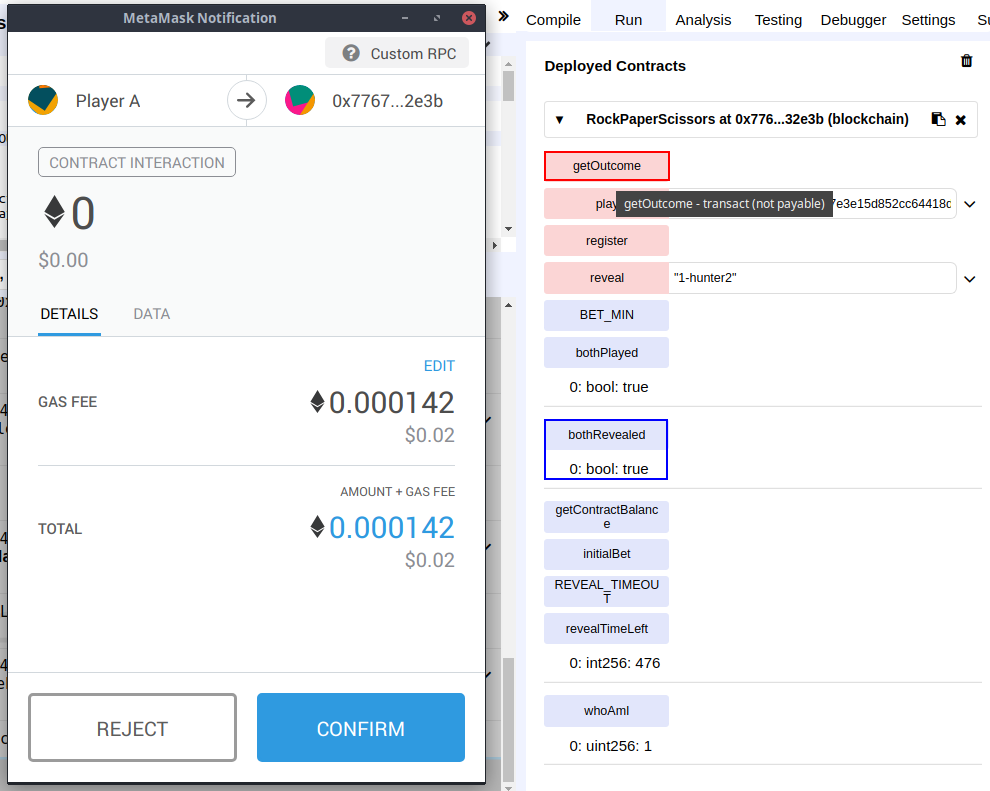
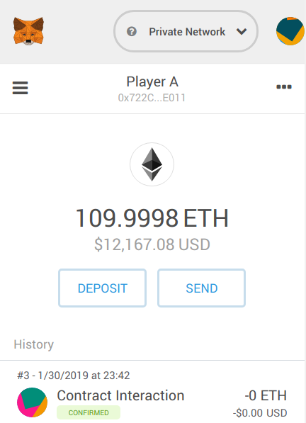
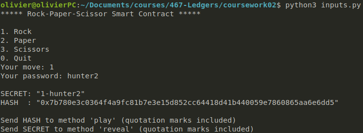

# Rock-Paper-Scissors Smart Contract

## Contents

* [Description](#description)
    * [Threat Model](#threat-model)
* [Usage](#usage)
* [Implementation](#implementation)
    * [Registration Phase](#registration-phase)
    * [Commit Phase](#commit-phase)
    * [Reveal Phase](#reveal-phase)
    * [Result Phase](#result-phase)
    * [Helper Functions](#helper-functions)


## Description

This smart contract implements a secure Rock-Paper-Scissors game in [Solidity](https://solidity.readthedocs.io/en/v0.5.3/index.html), ready to be deployed on the Ethereum blockchain. The game follows these steps:
1. Two players register and place a bet.
2. Each participant picks a move and a password. They send the hash of the concatenated string to the contract which stores it.
3. When the two players have committed their moves, they reveal what they have played. To do so, they send their move and password in clear. The contract verifies that the hash of the received input matches the one stored.
4. When both player have revealed their move, the contract determines the winner and sends him/her the total betting pool. If there is a draw, each player gets their bet back.
5. The game resets and can be played again by new players.

### Threat Model

This contract is *secure* in the sense that a player who has access to the blockchain and its content would still not be able to guess another player's move. Indeed the contract never stores any of the players' move in clear, but only the hash of the move salted with a password only known to the player. Since players cannot change their move during the reveal phase (after they have both committed their choice), this effectively ensures that an opponent could not cheat by looking at transaction data and playing accordingly.

This assumes that the hash function used is both preimage resistant  and second-preimage resistant. But for the hash used, SHA256, no one has managed to break pre and second image resistance yet.


## Usage

1. Register with function `register()`. You must send a bet greater than or equal to both the minimum `BET_MIN` and to the first player's bet (if defined).

2. Commit a move with function `play(bytes32 encrMove)`. The format of the expected input is `"0xHASH"` where `HASH` is the SHA256 hash of a string `move-password`. `move` is an integer ranging from 1 to 3 which correspond to rock, paper and scissors respectively and `password` is a string that should be kept secret.

3. Only when you and your opponent have played, you can reveal your move with `reveal(string memory clearMove)`. The format of the expected input is `"move-passord"`.

4. When both players have revealed their move or when the reveal phase has ended, you can get the result and the reward via `getOutcome()`.


In the screenshots, player A and player B (who initially own 100 ethers each) have bet 10 ethers. Player A played rock while player B chose scissors. At the end of the game, player A won the total contract's balance.


A python script `inputs.py` is included to help generate expected inputs from an user's choice of a move and a password. The script works only with Python 3+. To use it, run:
```sh
python3 inputs.py
```



## Implementation

### Registration Phase

Anyone can register provided that they're not already registered and that their bet is greater than a fixed minimum, currently 1 finney.

If a player has already been registered, a second player wishing to register must place a bet greater than or equal to the bet of that previous player. This is to prevent the strategy of always betting a smaller amount than the opponent to minimize risks while maximizing gains. Of course there are no advantages of betting an amount strictly greater than the initial bet, but one should be free to waste his coins however he wants.

## Commit Phase

When a player has been registered successfully, he/she can play. As described previously, the player provides a SHA256 hash of the concatenation of a move, represented by an integer, and a secret password. The contract stores this hash and nobody except the player has access to the actual move. Once such a hash has been committed, it cannot be modified.

## Reveal Phase

The reveal phase begins when both player have committed their moves. A player reveals what he had played by sending `move-password`. The contract then checks if its indeed the move that was played by hashing it and comparing the result to the stored hash. If they're equal, the first character of the string (`move`, an integer) is saved and the contract waits for the second player to reveal its move.

They are two ways for the reveal phase to end: either the two players have revealed their moves or the second player fails to submit its move before the phase ends. Currently, the reveal phase begins as soon as one of the player reveals its move and lasts 10 minutes. This is to prevent a deadlock where the second player realizes he has lost (since he can now see his opponent's move) and does not bother to finish the game.

## Result Phase

When the reveal phase ends, any of the player can trigger the function `getOutcome()` to make the contract sends the rewards. The winner, if there is any, takes it all. In case of a draw, players get their bet back. A player that has not previously revealed its move has automatically lost.

Just before sending the coins, the contract resets the state of the game. This is done in this order to prevent potential [reentrancy attack](https://solidity.readthedocs.io/en/v0.4.24/security-considerations.html#re-entrancy).

## Helper Functions

At any time, players have access to public state variables and helper functions to get information about the state of the game.

Functions available are:
* `getContractBalance()`: to see the current value of the betting pool.
* `whoAmI()`: to see their player's ID: 1 or 2 if they are indeed registered or 0 if they're not.
* `bothPlayed()`: returns `true` if both players have played and that they're now able to go to the reveal phase.
* `bothRevealed()`: returns `true` if both players have revealed their move and that the contract is ready to send out the rewards.
* `revealTimeLeft()`: returns `REVEAL_TIMEOUT` if the timer of the reveal phase has not started yet, returns the time left otherwise

Public state variables are:
* `BET_MIN`: the minimal amount to be sent to the contract in order to register. Currently set to 1 finney.
* `REVEAL_TIMEOUT`: the duration of the reveal phase in seconds. Currently set to 10 minutes (600 seconds).
* `initial_bet`: the bet of the first player registered if there is one. The second player must place a bet greater than or equal to that amount.
